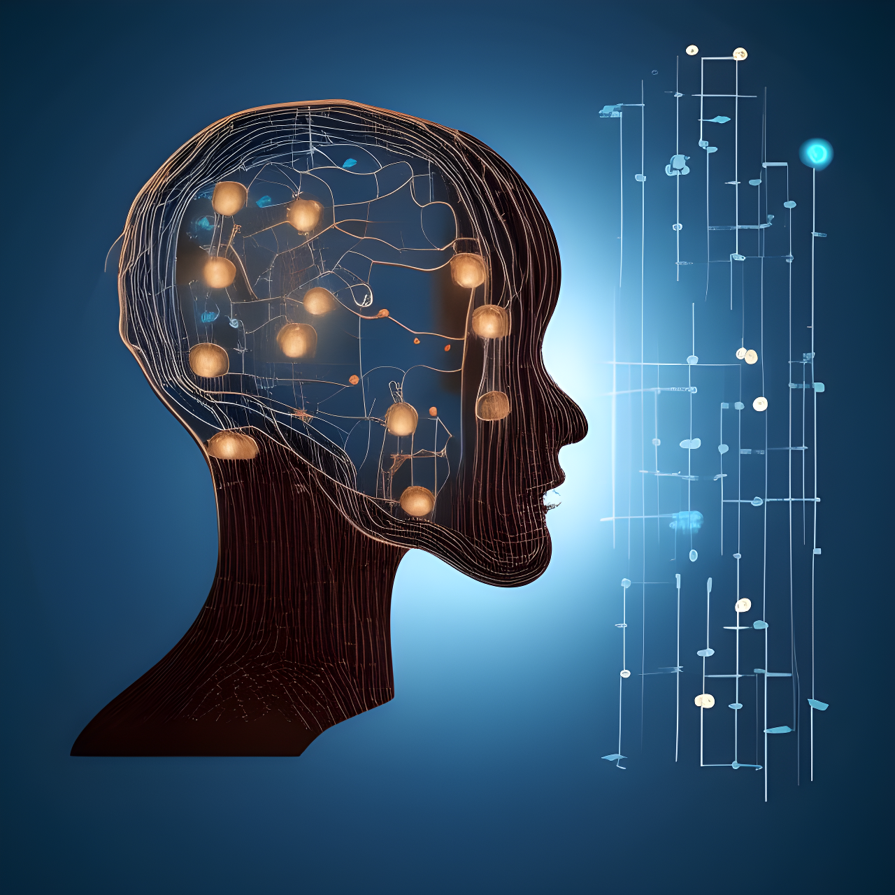

Welcome to my corner, where I explore Artificial Intelligence, unraveling the math in simple neural networks, exploring tricky algorithms, and peeking into the space where human smarts collide with AI.

This is my honest attempt to understand and share ideas that bridge the gap between our brains and artificial intelligence. I'd love for you to dive into the articles and share your thoughts and feedback. Let's explore this together!

